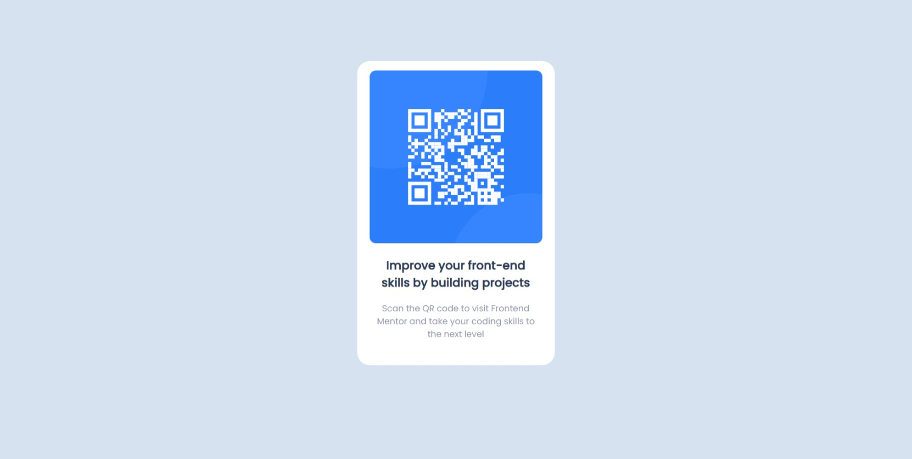

# Frontend Mentor - Solução do componente de QR Code

Essa é uma solução para o [QR code component challenge on Frontend Mentor](https://www.frontendmentor.io/challenges/qr-code-component-iux_sIO_H).
Os desafios do Front End Mentor te ajudam a melhorar seu código criando projetos realistas.

## Screenshot

## Construído com

- VS Code
- HTML semântico
- CSS
- Flexbox

## Links

- URL da solução: (https://gadiel-s.github.io/qr-codes-components/)
- Github: (https://github.com/Gadiel-S)
- Portfolio - [Gadiel Souza de Barros](https://gadiel-s.github.io/meu-portfolio/)
- Frontend Mentor - [@Gadiel-S](https://www.frontendmentor.io/profile/Gadiel-S)
